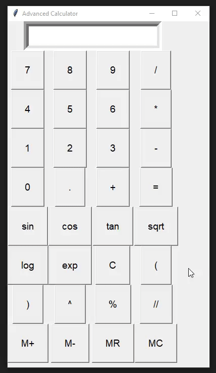

# Advanced Calculator with Python
**This is the outcome of this project:**



**Advanced Calculator** is a feature-rich GUI-based calculator built using Python's `tkinter` library. It offers basic arithmetic operations, scientific functions, memory storage, and more, all within a user-friendly interface. The calculator supports keyboard input and provides enhanced exception handling for a smooth user experience.

**Features**
- **Basic Operations:** Addition, subtraction, multiplication, and division.
- **Scientific Functions:** Includes sin, cos, tan, sqrt, log, exp, factorial, asin, acos, and atan.
- **Memory Functions:** Store, recall, and clear memory with M+, MR, MC, and M- buttons.
- **Keyboard Support:** Seamlessly type calculations using your keyboard.
- **Error Handling:** Specific handling for division by zero and other calculation errors.

**Outcome of this project:**

## Getting Started
- **Install Python:** Ensure you have Python installed on your system.
- Clone the Repository:
```Bash
git clone https://github.com/jcm-ai/Advanced-Calculator-with-Python.git
```
**Tkinter usually comes pre-installed with Python. You can check its availability by running the following command in your terminal or command prompt:**

```Bash
python -m tkinter
```
*If the Tkinter window appears, you're good to go. If not, you might need to install it.*

**Run the script:**
- Open a terminal (Command Prompt on Windows, Terminal on macOS or Linux).
- Navigate to the directory where your script is saved using the cd command. For example:
```Bash
cd path/to/your/script
```

**Run the script by typing:**
```Bash
python advanced_calculator.py
```
## Usage
Launch the application to start using the calculator. You can click the buttons or use your keyboard to input calculations. The result will be displayed in the entry widget.